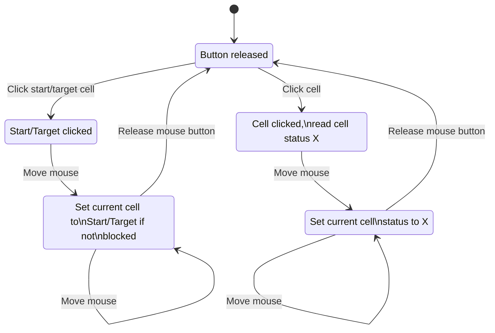

# Grid Mouse Input Handling

```mermaid
stateDiagram-v2
    state "Button released" as E
    state "Start/Target clicked" as A
    state "Cell clicked,\nread cell status X" as B
    state "Set current cell to\nStart/Target if not\nblocked" as C
    state "Set current cell\nstatus to X" as D
    [*] --> E
    E --> A: Click start/target cell
    E --> B: Click cell
    A --> C: Move mouse
    C --> C: Move mouse
    B --> D: Move mouse
    D --> D: Move mouse
    C --> E: Release mouse button
    D --> E: Release mouse button
```